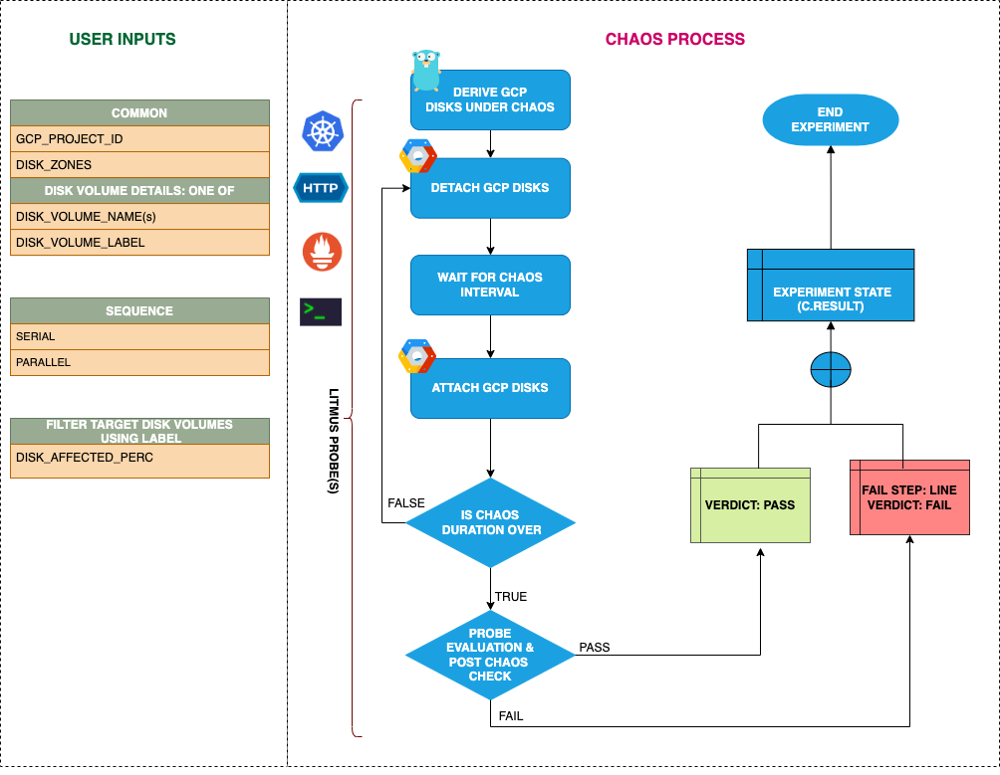

## Introduction

- It causes chaos to disrupt the state of GCP persistent disk volume filtered using a label by detaching it from its VM instance for a certain chaos duration.

!!! tip "Scenario: detach the gcp disk"    
    

## Uses

??? info "View the uses of the experiment" 
    coming soon

## Prerequisites

??? info "Verify the prerequisites" 
    - Ensure that Kubernetes Version > 1.17
    -  Ensure that the Chaos Operator is running by executing <code>kubectl get pods</code> in operator namespace (typically, <code>litmus</code>).If not, install from <a href="https://v1-docs.litmuschaos.io/docs/getstarted/#install-litmus">here</a>
    -  Ensure that the <code>gcp-vm-disk-loss-by-label</code> experiment resource is available in the cluster by executing <code>kubectl get chaosexperiments</code> in the desired namespace. If not, install from <a href="https://hub.litmuschaos.io/api/chaos/master?file=charts/gcp/gcp-vm-disk-loss-by-label/experiment.yaml">here</a>
    - Ensure that your service account has an editor access or owner access for the GCP project.
    - Ensure that the target disk volume is not a boot disk of any VM instance.
    - Ensure to create a Kubernetes secret having the GCP service account credentials in the default namespace. A sample secret file looks like:

        ```yaml
        apiVersion: v1
        kind: Secret
        metadata:
          name: cloud-secret
        type: Opaque
        stringData:
          type: 
          project_id: 
          private_key_id: 
          private_key: 
          client_email: 
          client_id: 
          auth_uri: 
          token_uri: 
          auth_provider_x509_cert_url: 
          client_x509_cert_url: 
        ``` 
    
## Default Validations

??? info "View the default validations" 
    - All the disk volumes having the target label are attached to their respective instances

## Minimal RBAC configuration example (optional)

!!! tip "NOTE"   
    If you are using this experiment as part of a litmus workflow scheduled constructed & executed from chaos-center, then you may be making use of the [litmus-admin](https://litmuschaos.github.io/litmus/litmus-admin-rbac.yaml) RBAC, which is pre installed in the cluster as part of the agent setup.

    ??? note "View the Minimal RBAC permissions"

        [embedmd]:# (https://raw.githubusercontent.com/litmuschaos/chaos-charts/master/charts/gcp/gcp-vm-disk-loss-by-label/rbac.yaml yaml)
        ```yaml
        ---
        apiVersion: v1
        kind: ServiceAccount
        metadata:
          name: gcp-vm-disk-loss-by-label-sa
          namespace: default
          labels:
            name: gcp-vm-disk-loss-by-label-sa
            app.kubernetes.io/part-of: litmus
        ---
        apiVersion: rbac.authorization.k8s.io/v1
        kind: ClusterRole
        metadata:
          name: gcp-vm-disk-loss-by-label-sa
          labels:
            name: gcp-vm-disk-loss-by-label-sa
            app.kubernetes.io/part-of: litmus
        rules:
          # Create and monitor the experiment & helper pods
          - apiGroups: [""]
            resources: ["pods"]
            verbs: ["create","delete","get","list","patch","update", "deletecollection"]
          # Performs CRUD operations on the events inside chaosengine and chaosresult
          - apiGroups: [""]
            resources: ["events"]
            verbs: ["create","get","list","patch","update"]
          # Fetch configmaps & secrets details and mount it to the experiment pod (if specified)
          - apiGroups: [""]
            resources: ["secrets","configmaps"]
            verbs: ["get","list",]
          # Track and get the runner, experiment, and helper pods log 
          - apiGroups: [""]
            resources: ["pods/log"]
            verbs: ["get","list","watch"]  
          # for configuring and monitor the experiment job by the chaos-runner pod
          - apiGroups: ["batch"]
            resources: ["jobs"]
            verbs: ["create","list","get","delete","deletecollection"]
          # for creation, status polling and deletion of litmus chaos resources used within a chaos workflow
          - apiGroups: ["litmuschaos.io"]
            resources: ["chaosengines","chaosexperiments","chaosresults"]
            verbs: ["create","list","get","patch","update","delete"]
        ---
        apiVersion: rbac.authorization.k8s.io/v1
        kind: ClusterRoleBinding
        metadata:
          name: gcp-vm-disk-loss-by-label-sa
          labels:
            name: gcp-vm-disk-loss-by-label-sa
            app.kubernetes.io/part-of: litmus
        roleRef:
          apiGroup: rbac.authorization.k8s.io
          kind: ClusterRole
          name: gcp-vm-disk-loss-by-label-sa
        subjects:
        - kind: ServiceAccount
          name: gcp-vm-disk-loss-by-label-sa
          namespace: default
        ```
        Use this sample RBAC manifest to create a chaosServiceAccount in the desired (app) namespace. This example consists of the minimum necessary role permissions to execute the experiment.

## Experiment tunables

??? info "check the experiment tunables"
    <h2>Mandatory Fields</h2>

    <table>
      <tr>
        <th> Variables </th>
        <th> Description </th>
        <th> Notes </th>
      </tr>
      <tr> 
        <td> GCP_PROJECT_ID </td>
        <td> The ID of the GCP Project of which the disk volumes are a part of </td>
        <td> All the target disk volumes should belong to a single GCP Project </td>
      </tr>
      <tr> 
        <td> DISK_VOLUME_LABEL </td>
        <td>Label of the targeted non-boot persistent disk volume</td>
        <td> The <code>DISK_VOLUME_LABEL</code> should be provided as <code>key:value</code> or <code>key</code> if the corresponding value is empty ex: <code>disk:target-disk</code> </td>
      </tr>  
      <tr>
        <td> ZONES </td>
        <td> The zone of target disk volumes </td>
        <td> Only one zone can be provided i.e. all target disks should lie in the same zone </td>
      </tr>
    </table>
    
    <h2>Optional Fields</h2>

    <table>
      <tr>
        <th> Variables </th>
        <th> Description </th>
        <th> Notes </th>
      </tr>
      <tr> 
        <td> TOTAL_CHAOS_DURATION </td>
        <td> The total time duration for chaos insertion (sec) </td>
        <td> Defaults to 30s </td>
      </tr>
       <tr> 
        <td> CHAOS_INTERVAL </td>
        <td> The interval (in sec) between the successive chaos iterations (sec) </td>
        <td> Defaults to 30s </td>
      </tr>  
      <tr> 
        <td> DISK_AFFECTED_PERC </td>
        <td> The percentage of total disks filtered using the label to target </td>
        <td> Defaults to 0 (corresponds to 1 disk), provide numeric value only </td>
      </tr> 
      <tr>
        <td> SEQUENCE </td>
        <td> It defines sequence of chaos execution for multiple disks </td>
        <td> Default value: parallel. Supported: serial, parallel </td>
      </tr> 
      <tr>
        <td> RAMP_TIME </td>
        <td> Period to wait before and after injection of chaos in sec </td>
        <td> </td>
      </tr>
    </table>

## Experiment Examples

### Common Experiment Tunables

Refer the [common attributes](../common/common-tunables-for-all-experiments.md) to tune the common tunables for all the experiments.

### Detach Volumes By Label

It contains the label of disk volumes to be subjected to disk loss chaos. It will detach all the disks with the label `DISK_VOLUME_LABEL` in zone `ZONES` within the `GCP_PROJECT_ID` project.  It re-attaches the disk volume after waiting for the specified `TOTAL_CHAOS_DURATION` duration.

`NOTE:` The `DISK_VOLUME_LABEL` accepts only one label and `ZONES` also accepts only one zone name. Therefore, all the disks must lie in the same zone.

Use the following example to tune this:

[embedmd]:# (https://raw.githubusercontent.com/litmuschaos/litmus/master/mkdocs/docs/experiments/categories/gcp/gcp-vm-disk-loss-by-label/gcp-disk-loss.yaml yaml)
```yaml
apiVersion: litmuschaos.io/v1alpha1
kind: ChaosEngine
metadata:
  name: engine-nginx
spec:
  engineState: "active"
  annotationCheck: "false"
  chaosServiceAccount: gcp-vm-disk-loss-by-label-sa
  experiments:
  - name: gcp-vm-disk-loss-by-label
    spec:
      components:
        env:
        - name: DISK_VOLUME_LABEL
          value: 'disk:target-disk'
        
        - name: ZONES
          value: 'us-east1-b'
        
        - name: GCP_PROJECT_ID
          value: 'my-project-4513'
        
        - name: TOTAL_CHAOS_DURATION
          value: '60'
```

### Mutiple Iterations Of Chaos

The multiple iterations of chaos can be tuned via setting `CHAOS_INTERVAL` ENV. Which defines the delay between each iteration of chaos.

Use the following example to tune this:

[embedmd]:# (https://raw.githubusercontent.com/litmuschaos/litmus/master/mkdocs/docs/experiments/categories/gcp/gcp-vm-disk-loss-by-label/chaos-interval.yaml yaml)
```yaml
apiVersion: litmuschaos.io/v1alpha1
kind: ChaosEngine
metadata:
  name: engine-nginx
spec:
  engineState: "active"
  annotationCheck: "false"
  chaosServiceAccount: gcp-vm-disk-loss-by-label-sa
  experiments:
  - name: gcp-vm-disk-loss-by-label
    spec:
      components:
        env:
        - name: CHAOS_INTERVAL
          value: '15'
        
        - name: TOTAL_CHAOS_DURATION
          value: '60'
        
        - name: DISK_VOLUME_LABEL
          value: 'disk:target-disk'
        
        - name: ZONES
          value: 'us-east1-b'
        
        - name: GCP_PROJECT_ID
          value: 'my-project-4513'
```
