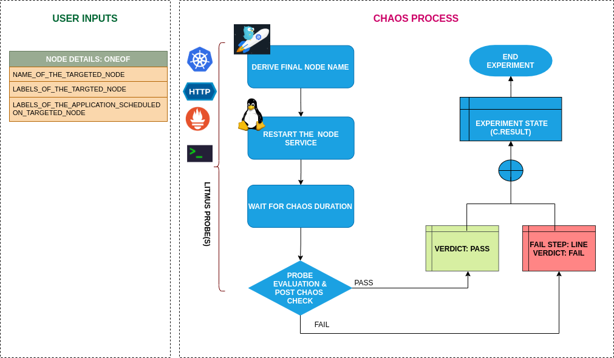

## Introduction

- This experiment Causes the application to become unreachable on account of node turning unschedulable (NotReady) due to kubelet service kill.
- The kubelet service has been stopped/killed on a node to make it unschedulable for a certain duration i.e TOTAL_CHAOS_DURATION. The application node should be healthy after the chaos injection and the services should be reaccessable.
- The application implies services. Can be reframed as: Test application resiliency upon replica getting unreachable caused due to kubelet service down.

!!! tip "Scenario: Kill the kubelet service of the node"    
    

## Uses

??? info "View the uses of the experiment" 
    coming soon

## Prerequisites

??? info "Verify the prerequisites" 
    - Ensure that Kubernetes Version > 1.16 
    - Ensure that the Litmus Chaos Operator is running by executing <code>kubectl get pods</code> in operator namespace (typically, <code>litmus</code>).If not, install from <a herf="https://docs.litmuschaos.io/docs/getstarted/#install-litmus">here</a>
    - Ensure that the <code>kubelet-service-kill</code> experiment resource is available in the cluster by executing <code>kubectl get chaosexperiments</code> in the desired namespace. If not, install from <a herf="https://hub.litmuschaos.io/api/chaos/master?file=charts/generic/kubelet-service-kill/experiment.yaml">here</a>
    - Ensure that the node specified in the experiment ENV variable <code>TARGET_NODE</code> (the node for which kubelet service need to be killed) should be cordoned before execution of the chaos experiment (before applying the chaosengine manifest) to ensure that the litmus experiment runner pods are not scheduled on it / subjected to eviction. This can be achieved with the following steps:
        - Get node names against the applications pods: <code>kubectl get pods -o wide</code>
        - Cordon the node <code>kubectl cordon &lt;nodename&gt;</code>
    
## Default Validations

??? info "View the default validations" 
    The target nodes should be in ready state before and after chaos injection.

## Minimal RBAC configuration example (optional)

??? note "View the Minimal RBAC permissions"

    [embedmd]:# (https://raw.githubusercontent.com/litmuschaos/chaos-charts/master/charts/generic/kubelet-service-kill/rbac.yaml yaml)
    ```yaml
    ---
    apiVersion: v1
    kind: ServiceAccount
    metadata:
      name: kubelet-service-kill-sa
      namespace: default
      labels:
        name: kubelet-service-kill-sa
        app.kubernetes.io/part-of: litmus
    ---
    apiVersion: rbac.authorization.k8s.io/v1
    kind: ClusterRole
    metadata:
      name: kubelet-service-kill-sa
      labels:
        name: kubelet-service-kill-sa
        app.kubernetes.io/part-of: litmus
    rules:
    - apiGroups: [""]
      resources: ["pods","events"]
      verbs: ["create","list","get","patch","update","delete","deletecollection"]
    - apiGroups: [""]
      resources: ["pods/exec","pods/log"]
      verbs: ["create","list","get"]
    - apiGroups: ["batch"]
      resources: ["jobs"]
      verbs: ["create","list","get","delete","deletecollection"]
    - apiGroups: ["litmuschaos.io"]
      resources: ["chaosengines","chaosexperiments","chaosresults"]
      verbs: ["create","list","get","patch","update"]
    - apiGroups: [""]
      resources: ["nodes"]
      verbs: ["get","list"]
    ---
    apiVersion: rbac.authorization.k8s.io/v1
    kind: ClusterRoleBinding
    metadata:
      name: kubelet-service-kill-sa
      labels:
        name: kubelet-service-kill-sa
        app.kubernetes.io/part-of: litmus
    roleRef:
      apiGroup: rbac.authorization.k8s.io
      kind: ClusterRole
      name: kubelet-service-kill-sa
    subjects:
    - kind: ServiceAccount
      name: kubelet-service-kill-sa
      namespace: default
    ```

    Use this sample RBAC manifest to create a chaosServiceAccount in the desired (app) namespace. This example consists of the minimum necessary role permissions to execute the experiment.

## Experiment tunables

??? info "check the experiment tunables"
    <h2>Mandatory Fields</h2>

    <table>
      <tr>
        <th> Variables </th>
        <th> Description </th>
        <th> Notes </th>
      </tr>
      <tr>
        <td> TARGET_NODE </td>
        <td> Name of the target node</td>
        <td> </td>
      </tr>
      <tr>
        <td> NODE_LABEL </td>
        <td> It contains node label, which will be used to filter the target node if TARGET_NODE ENV is not set </td>
        <td>It is mutually exclusive with the TARGET_NODE ENV. If both are provided then it will use the TARGET_NODE</td>
      </tr>
    </table>
    
    <h2>Optional Fields</h2>

    <table>
      <tr>
        <th> Variables </th>
        <th> Description </th>
        <th> Notes </th>
      </tr>
      <tr>
        <td> TOTAL_CHAOS_DURATION </td>
        <td> The time duration for chaos insertion (seconds)  </td>
        <td> Defaults to 60s </td>
      </tr>
      <tr>
        <td> LIB  </td>
        <td> The chaos lib used to inject the chaos </td>
        <td> Defaults to <code>litmus</code> </td>
      </tr>
      <tr>
        <td> LIB_IMAGE  </td>
        <td> The lib image used to inject kubelet kill chaos the image should have systemd installed in it. </td>
        <td> Defaults to <code>ubuntu:16.04</code> </td>
      </tr>  
      <tr>
        <td> RAMP_TIME </td>
        <td> Period to wait before injection of chaos in sec </td>
        <td> </td>
      </tr>
    </table>

## Experiment Examples

### Common and Node specific tunables

Refer the [common attributes](../common/common-tunables-for-all-experiments.md) and [Node specific tunable](common-tunables-for-node-experiments.md) to tune the common tunables for all experiments and node specific tunables.  

### Kill Kubelet Service

It contains name of target node subjected to the chaos. It can be tuned via `TARGET_NODE` ENV.

Use the following example to tune this:

[embedmd]:# (https://raw.githubusercontent.com/litmuschaos/litmus/master/mkdocs/docs/experiments/categories/nodes/kubelet-service-kill/kubelet-service-kill.yaml yaml)
```yaml
# kill the kubelet service of the target node
apiVersion: litmuschaos.io/v1alpha1
kind: ChaosEngine
metadata:
  name: engine-nginx
spec:
  engineState: "active"
  annotationCheck: "false"
  chaosServiceAccount: kubelet-service-kill-sa
  experiments:
  - name: kubelet-service-kill
    spec:
      components:
        env:
        # name of the target node
        - name: TARGET_NODE
          value: 'node01'
        - name: TOTAL_CHAOS_DURATION
          VALUE: '60'
```
