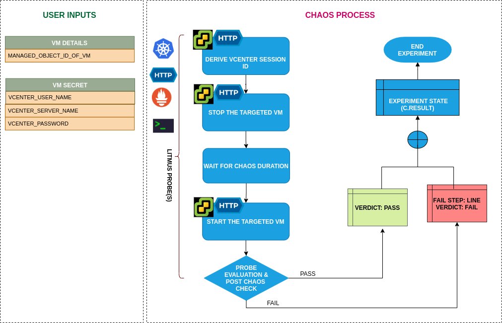

## Introduction

- It causes Stops/PowerOff a VM before bringing it back to running state after a specified chaos duration
Experiment uses vmware api's to start/stop the target vm.
- It helps to check the performance of the application/process running on the vmware server.

!!! tip "Scenario: poweroff the vm"    
    

## Uses

??? info "View the uses of the experiment" 
    coming soon

## Prerequisites

??? info "Verify the prerequisites" 
    - Ensure that Kubernetes Version > 1.16 
    -  Ensure that the Litmus Chaos Operator is running by executing <code>kubectl get pods</code> in operator namespace (typically, <code>litmus</code>).If not, install from <a herf="https://docs.litmuschaos.io/docs/getstarted/#install-litmus">here</a>
    -  Ensure that the <code>vm-poweroff</code> experiment resource is available in the cluster by executing <code>kubectl get chaosexperiments</code> in the desired namespace. If not, install from <a herf="https://hub.litmuschaos.io/api/chaos/master?file=charts/vmware/vm-poweroff/experiment.yaml">here</a>
    - Ensure that you have sufficient Vcenter access to stop and start the vm.
    - (Optional) Ensure to create a Kubernetes secret having the Vcenter credentials in the `CHAOS_NAMESPACE`. A sample secret file looks like:

        ```yaml
        apiVersion: v1
        kind: Secret
        metadata:
          name: vcenter-secret
          namespace: litmus
        type: Opaque
        stringData:
            VCENTERSERVER: XXXXXXXXXXX
            VCENTERUSER: XXXXXXXXXXXXX
            VCENTERPASS: XXXXXXXXXXXXX
        ```

    **Note:** You can pass the VM credentials as secrets or as an chaosengine ENV variable. 
    
## Default Validations

??? info "View the default validations" 
    - VM instance should be in healthy state.

## Minimal RBAC configuration example (optional)

!!! tip "NOTE"   
    If you are using this experiment as part of a litmus workflow scheduled constructed & executed from chaos-center, then you may be making use of the [litmus-admin](https://litmuschaos.github.io/litmus/litmus-admin-rbac.yaml) RBAC, which is pre installed in the cluster as part of the agent setup.

    ??? note "View the Minimal RBAC permissions"

        [embedmd]:# (https://raw.githubusercontent.com/litmuschaos/chaos-charts/master/charts/vmware/vm-poweroff/rbac.yaml yaml)
        ```yaml
        ---
        apiVersion: v1
        kind: ServiceAccount
        metadata:
          name: vm-poweroff-sa
          namespace: default
          labels:
            name: vm-poweroff-sa
            app.kubernetes.io/part-of: litmus
        ---
        apiVersion: rbac.authorization.k8s.io/v1
        kind: ClusterRole
        metadata:
          name: vm-poweroff-sa
          labels:
            name: vm-poweroff-sa
            app.kubernetes.io/part-of: litmus
        rules:
        - apiGroups: [""]
          resources: ["pods","events","secrets"]
          verbs: ["create","list","get","patch","update","delete","deletecollection"]
        - apiGroups: [""]
          resources: ["pods/exec","pods/log"]
          verbs: ["create","list","get"]
        - apiGroups: ["batch"]
          resources: ["jobs"]
          verbs: ["create","list","get","delete","deletecollection"]
        - apiGroups: ["litmuschaos.io"]
          resources: ["chaosengines","chaosexperiments","chaosresults"]
          verbs: ["create","list","get","patch","update"]
        ---
        apiVersion: rbac.authorization.k8s.io/v1
        kind: ClusterRoleBinding
        metadata:
          name: vm-poweroff-sa
          labels:
            name: vm-poweroff-sa
            app.kubernetes.io/part-of: litmus
        roleRef:
          apiGroup: rbac.authorization.k8s.io
          kind: ClusterRole
          name: vm-poweroff-sa
        subjects:
        - kind: ServiceAccount
          name: vm-poweroff-sa
          namespace: default
        ```
        Use this sample RBAC manifest to create a chaosServiceAccount in the desired (app) namespace. This example consists of the minimum necessary role permissions to execute the experiment.

## Experiment tunables

??? info "check the experiment tunables"
    <h2>Mandatory Fields</h2>

    <table>
      <tr>
        <th> Variables </th>
        <th> Description </th>
        <th> Notes </th>
      </tr>
      <tr>
        <td> APP_VM_MOID </td>
        <td> Moid of the vmware instance</td>
        <td> Once you open VM in vCenter WebClient, you can find MOID in address field (VirtualMachine:vm-5365). Eg: vm-5365 </td>
      </tr>
    </table>
    
    <h2>Optional Fields</h2>

    <table>
      <tr>
        <th> Variables </th>
        <th> Description </th>
        <th> Notes </th>
      </tr>
      <tr> 
        <td> TOTAL_CHAOS_DURATION </td>
        <td> The total time duration for chaos insertion (sec) </td>
        <td> Defaults to 30s </td>
      </tr>
      <tr>
        <td> RAMP_TIME </td>
        <td> Period to wait before and after injection of chaos in sec </td>
        <td> </td>
      </tr>
    </table>

## Experiment Examples

### Common Experiment Tunables

Refer the [common attributes](../common/common-tunables-for-all-experiments.md) to tune the common tunables for all the experiments.

### Stop/Poweroff VM By MOID

It contains moid of the vm instance. It can be tuned via `APP_VM_MOID` ENV.

Use the following example to tune this:

[embedmd]:# (https://raw.githubusercontent.com/litmuschaos/litmus/master/mkdocs/docs/experiments/categories/vmware/vm-poweroff/app-vm-moid.yaml yaml)
```yaml
# power-off the vmware vm
apiVersion: litmuschaos.io/v1alpha1
kind: ChaosEngine
metadata:
  name: engine-nginx
spec:
  engineState: "active"
  annotationCheck: "false"
  chaosServiceAccount: vm-poweroff-sa
  experiments:
  - name: vm-poweroff
    spec:
      components:
        env:
        # moid of the vm instance
        - name: APP_VM_MOID
          value: 'vm-5365'
        - name: TOTAL_CHAOS_DURATION
          VALUE: '60'
```
